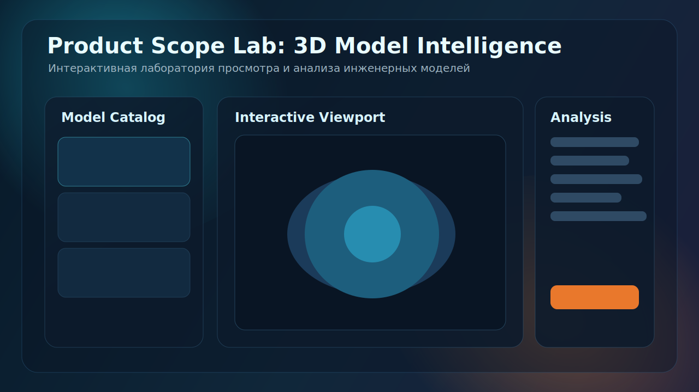

# Product Scope Lab

Веб-приложение для просмотра и анализа 3D-моделей инженерных изделий. Проект реализован с архитектурой FSD и поддерживает интерактивный рендер, настройку сцены, расчет геометрических метрик и экспорт результатов анализа.

## Список технологий

- `React` для UI-композиции и декларативной разработки интерфейса.
- `TypeScript` для строгой типизации состояния, сущностей и API между слоями FSD.
- `Three.js` для рендера 3D-сцены, камеры, света и инспекции модели.
- `Zustand` для централизованного управления настройками просмотра и метриками.
- `MUI` для быстрой сборки адаптивного интерфейса и единых UI-компонентов.
- `Vite` для сборки, dev-сервера и быстрой итерации.

## Памятка по запуску

```bash
cd app
npm install
npm run dev
```

Приложение будет доступно на `http://localhost:5173`.

Дополнительные команды:

```bash
npm run lint
npm run build
npm run preview
```

## Скриншот стартовой страницы


